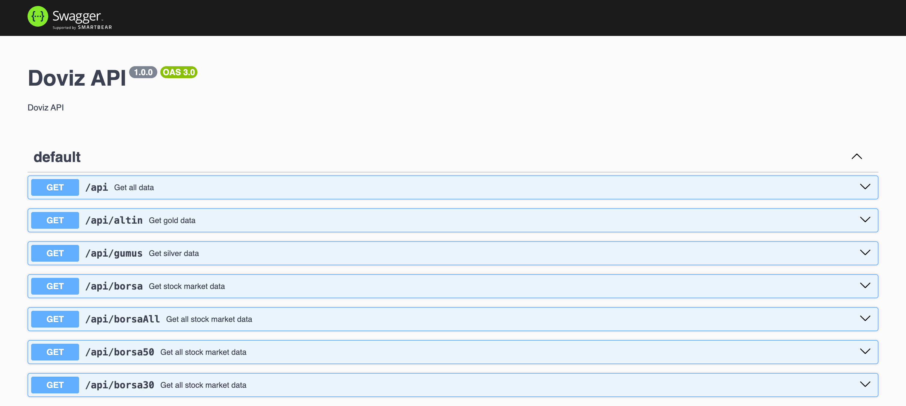

# Doviz-API

Bilgiler uzman.milliyet.com'den alınmıştır.

| Route       | HTTP Verb | Description                                                                       |
|-------------|-----------|-----------------------------------------------------------------------------------|
| /api/       | `GET`     | Bist100,Dolar,Euro,Altın,Petrol,Bono                                              |
| /api/altin  | `GET`     | Altın, Altın Ons, Bilezik, Cumhuriyet Altın, Tam Altın, Yarım Altın, Çeyrek Altın |
| /api/gumus  | `GET`     | Gumus Gram, Gumus, Gumus Euro, Gumus Dolar, Gumus TRY                             |
| /api/borsa  | `GET`     | Bist 100 Hisseler                                                                 |
| /api/borsa30 | `GET`     | Bist 30 Hisseler                                                                  |
| /api/borsa50 | `GET`     | Bist 50 Hisseler                                                                  |
| /api/borsaAll | `GET`     | Bist Tüm Hisseler                                                                 |
| /api/{stock} | `GET`     | Verilen hissenin bilgilerini getirir                                              |
| /api/indices       | `GET`     | XU100, XSTKR, XGIDA gibi endeksleri getirir                                       |
| /api-docs   | `GET`     | Swagger UI                                                                        |

# Docker Run

Öncelikle bir Docker image'ını oluşturun:
`
docker build -t dovizapp .
`

Ve daha sonra bu image'i çalıştıralım
`
docker run dovizapp  
`

Eğer uygulamayı durdurmak istiyorsanız.
`
docker stop {container id}
`

# Swagger UI

